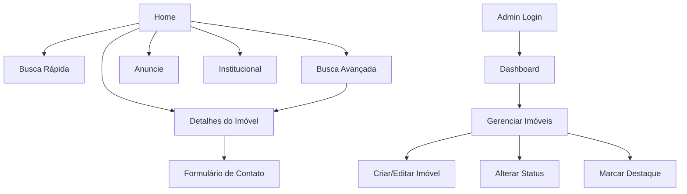

## 1. Visão Geral do Produto

O Santana Terras é um site de catálogo de imóveis especializado em propriedades rurais, desenvolvido para apresentar imóveis da região de forma profissional e acessível. O sistema permite que visitantes visualizem e filtrem imóveis, enquanto o administrador gerencia todo o conteúdo através de um painel exclusivo.

O produto resolve o problema de apresentação de imóveis rurais de forma organizada e profissional, facilitando a busca por propriedades ideais para quem deseja morar no campo ou investir em terras rurais. O público-alvo inclui pessoas buscando imóveis rurais e proprietários interessados em vender suas propriedades.

## 2. Funcionalidades Principais

### 2.1 Páginas do Site Público
O site Santana Terras consiste nas seguintes páginas principais:

1. **Home**: Banner principal, busca rápida, imóveis em destaque, imóveis recentes
2. **Busca de Imóveis**: Galeria de imóveis com filtros laterais avançados
3. **Detalhes do Imóvel**: Galeria de fotos, informações completas, formulário de contato
4. **Anuncie seu Imóvel**: Landing page para captação de novos clientes
5. **Institucional**: Página sobre a empresa e informações de contato

### 2.2 Páginas do Painel Administrativo
O painel administrativo inclui:

1. **Login**: Página de autenticação do administrador
2. **Dashboard**: Visão geral com métricas e estatísticas
3. **Gerenciar Imóveis**: Lista com ações de CRUD
4. **Criar/Editar Imóvel**: Formulário completo com upload de mídias
5. **Configurações**: Preferências do sistema

### 2.3 Detalhamento das Funcionalidades

| Página | Módulo | Descrição das Funcionalidades |
|--------|--------|-------------------------------|
| Home | Banner Principal | Apresentação visual com imagens de destaque e chamada para ação |
| Home | Busca Rápida | Formulário com filtros básicos (tipo, localização, faixa de preço) |
| Home | Imóveis em Destaque | Carrossel com imóveis marcados como destaque pelo administrador |
| Home | Imóveis Recentes | Lista dos últimos imóveis adicionados ao sistema |
| Busca | Galeria de Imóveis | Grid responsivo com cards de imóveis e paginação |
| Busca | Filtros Laterais | Filtros por tipo, preço, área, quartos, comodidades |
| Busca | Ordenação | Opções para ordenar por preço, data, área |
| Detalhes | Galeria de Fotos | Visualização em grid e modo slideshow com zoom |
| Detalhes | Informações do Imóvel | Tabela com todas as características e descrição completa |
| Detalhes | Formulário de Contato | Campos para nome, telefone, email e mensagem com validação |
| Anuncie | Landing Page | Seções sobre vantagens, depoimentos e formulário de contato |
| Institucional | Sobre | História da empresa, missão, visão e valores |
| Institucional | Contato | Informações de contato, horário de funcionamento e mapa |
| Admin/Login | Autenticação | Formulário seguro com validação e recuperação de senha |
| Admin/Dashboard | Métricas | Total de imóveis, visualizações, contatos recebidos |
| Admin/Imóveis | Lista | Tabela com busca, filtros e ações de editar/excluir |
| Admin/Imóveis | CRUD | Criar, visualizar, editar e excluir imóveis com validação |
| Admin/Imóveis | Upload de Mídias | Upload múltiplo de fotos com preview e ordenação |
| Admin/Imóveis | Status | Controle de rascunho/publicado/inativo |
| Admin/Imóveis | Destaque | Marcar/desmarcar imóveis como destaque |

## 3. Fluxo de Navegação

### Fluxo do Visitante
O visitante acessa a home page, pode realizar uma busca rápida ou navegar para a página de busca avançada. Ao encontrar um imóvel interessante, acessa os detalhes e pode entrar em contato. Também pode acessar as páginas institucionais ou a página de anunciar imóvel.

### Fluxo do Administrador
O administrador acessa o painel através da página de login, visualiza o dashboard com métricas, gerencia os imóveis através do CRUD completo e controla o status de publicação dos imóveis.

## 4. Design da Interface

### 4.1 Estilo Visual
- **Cores Primárias**: Vermelho (#DC2626) da logo, Cinza/Preto (#1F2937) da logo
- **Cores Secundárias**: Branco (#FFFFFF) para fundo, Verde/Azul (#059669) para CTA
- **Botões**: Estilo arredondado com sombra suave e hover effects
- **Tipografia**: Fonte moderna sans-serif (Inter ou similar), tamanhos hierárquicos claros
- **Layout**: Baseado em cards com espaçamento generoso, navegação superior fixa
- **Ícones**: Estilo line icons modernos, consistentes com a identidade visual

### 4.2 Elementos por Página

| Página | Módulo | Elementos de UI |
|--------|--------|-----------------|
| Home | Banner | Slideshow com transição suave, altura 60vh, overlay com CTA |
| Home | Busca | Card branco arredondado, inputs com bordas suaves, botão verde prominente |
| Home | Cards de Imóvel | Ratio 4:3 para fotos, badge de destaque vermelho, preço em negrito |
| Busca | Sidebar | Fundo cinza claro, filtros em accordion, checkbox customizado |
| Busca | Grid | 3 colunas desktop, 2 tablet, 1 mobile, gap consistente |
| Detalhes | Galeria | Thumbnails horizontais, botão de fullscreen, navegação por setas |
| Detalhes | Formulário | Campos com labels flutuantes, validação em tempo real, botão fixo mobile |
| Admin | Tabela | Striped rows, actions com ícones, paginação bottom |
| Admin | Formulário | Multi-step com progress bar, preview de imagens, drag-and-drop |

### 4.3 Responsividade
- Mobile-first approach com breakpoints em 640px, 768px, 1024px, 1280px
- Menu hamburger para mobile com slide drawer
- Touch gestures em galerias e carrosséis
- Font sizes adaptativas (16px base, scale fluid)
- Botões CTA fixos em mobile para fácil acesso

## 5. Tipos e Características dos Imóveis

### 5.1 Tipos de Imóveis
- Sítio
- Chácara
- Casa
- Terreno
- Fazenda

### 5.2 Características Comuns
- **Quartos**: Número de quartos
- **Suítes**: Número de suítes
- **Banheiros**: Número de banheiros
- **Área Total**: Em hectares ou metros quadrados
- **Preço**: Valor numérico ou "Sob Consulta"

### 5.3 Comodidades
- Piscina
- Poço artesiano
- Churrasqueira
- Área de lazer
- Casa de caseiro
- Energia elétrica
- Água encanada
- Internet
- Aceita permuta

## 6. Requisitos Técnicos

### 6.1 Stack Tecnológico
- **Frontend**: React 18 + TypeScript + Vite
- **Backend**: Express.js + TypeScript
- **Banco de Dados**: Supabase (PostgreSQL)
- **Autenticação**: Supabase Auth
- **Storage**: Supabase Storage para imagens
- **Estilização**: Tailwind CSS
- **Estado**: Context API ou Zustand
- **Roteamento**: React Router v6
- **Validação**: React Hook Form + Zod

### 6.2 Arquitetura
- Frontend SPA com React
- Backend REST API com Express
- Supabase para dados, auth e storage
- Deploy separado para frontend e backend
- Imagens otimizadas com lazy loading
- Cache de browser para performance

### 6.3 Segurança
- Autenticação JWT com refresh tokens
- Validação de dados em frontend e backend
- Proteção contra SQL injection via Supabase
- Rate limiting em endpoints públicos
- Sanitização de inputs de formulário
- HTTPS obrigatório em produção

### 6.4 Performance
- Lazy loading de imagens
- Paginação server-side
- Debounce em buscas
- Compressão gzip
- Cache de imagens via CDN
- Bundle splitting por rotas